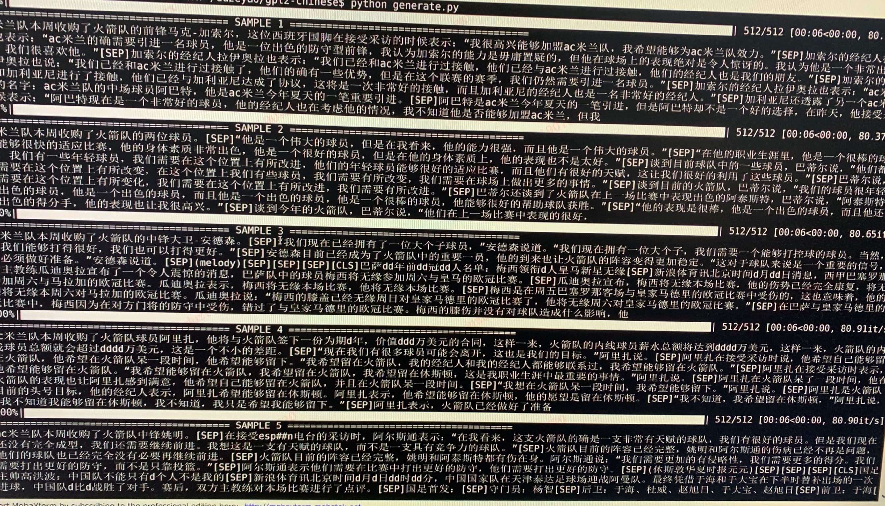
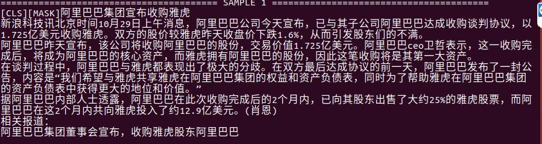
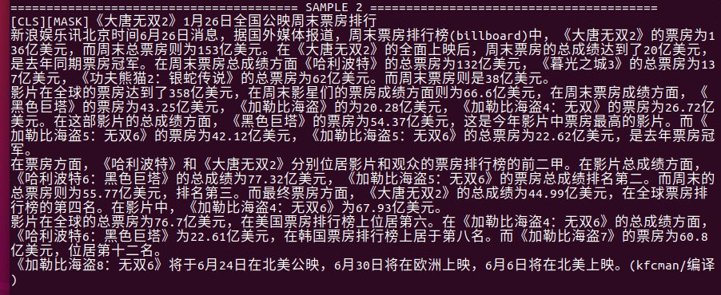
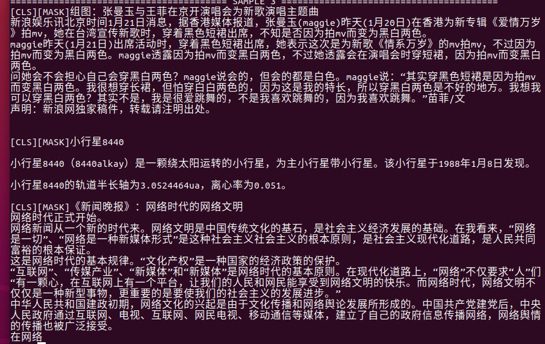
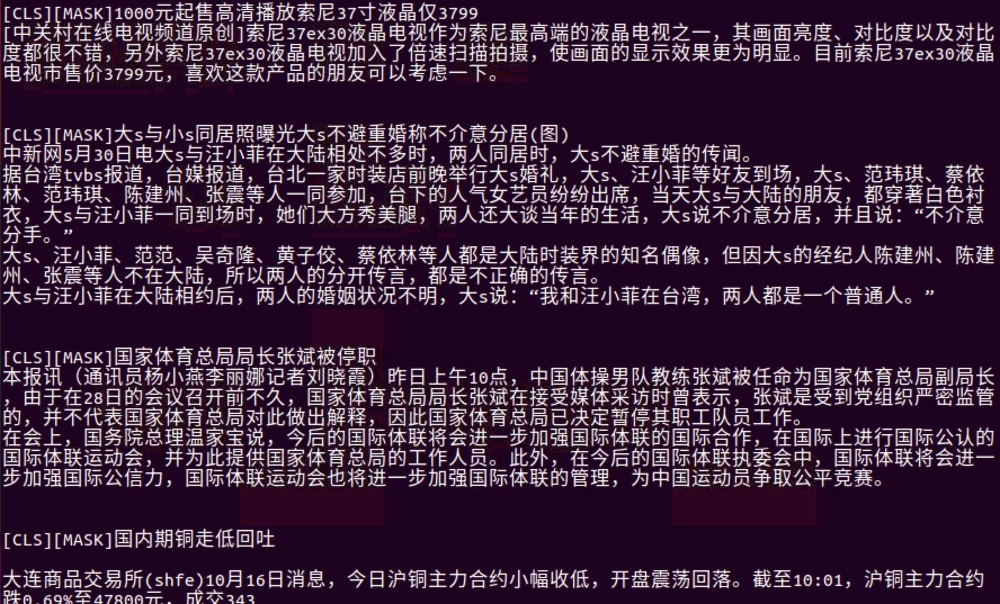

# GPT2-Chinese

## 项目状态

- 目前项目处于积极开发状态，但是主要架构已经稳定。如发现任何bug或是有功能意见与改进欢迎提交Issue，PR或是联系作者。

## 使用方法

- 在项目根目录建立data文件夹。将训练语料以train.json为名放入data目录中。train.json里是一个json列表，列表的每个元素都分别是一篇要训练的文章。
- 运行train.py文件，勾选 --raw ，会自动预处理数据。
- 预处理完成之后，直接运行train.py文件，即可开始训练。

## 文件结构

- generate.py 与 train.py 分别是生成与训练的脚本。
- train_single.py 是 train.py的延伸，可以用于一个很大的单独元素列表（如训练一本书）。
- eval.py 用于评估生成模型的ppl分值。
- generate_texts.py 是 generate.py 的延伸，可以以一个列表的起始关键词分别生成若干个句子并输出到文件中。
- train.json 是训练样本的格式范例，可供参考。
- cache 文件夹内包含若干BERT词表，vocab.txt 是原始BERT词表， vocab_all.txt 额外添加了古文词， vocab_small.txt 是小词表， no_word_piece的是没有word piece的词表。
- tokenizations 文件夹内是可以选用的三种tokenizer，包括默认的Bert Tokenizer，分词版Bert Tokenizer以及没有word piece的Bert Tokenizer。 

## 注意

- 本项目使用Bert的tokenizer处理中文字符。
- 如果使用分词版的tokenizer，不需要自己事先分词，tokenizer会帮你分。
- 模型需自行运算。各位如果完成了预训练的话欢迎进行交流。
- 如果你的内存非常大或者语料较小的话，可以改掉train.py内build files内的对应代码，不做拆分直接预处理语料。

## 语料

- 可以从[这里](https://github.com/brightmart/nlp_chinese_corpus)与[这里](http://thuctc.thunlp.org/#获取链接)下载。
- 斗破苍穹语料可以从[这里](https://github.com/GaoPeng97/transformer-xl-chinese/tree/master/data/doupo)下载。

## FP16与Gradient Accumulation支持

- 我在train.py文件中加入了fp16与gradient accumulation支持，如果你安装了apex并且知道fp16是什么的话，可以修改变量fp16=True来启用。

## 联系作者

- QQ：330501241
- Mail：ned1991@gmail.com

## Citing

```
@misc{GPT2-Chinese,
  author = {Zeyao Du},
  title = {GPT2-Chinese: Tools for training GPT2 model in Chinese language},
  year = {2019},
  publisher = {GitHub},
  journal = {GitHub repository},
  howpublished = {\url{https://github.com/Morizeyao/GPT2-Chinese}},
}
```
 
## 生成样例

- 下为斗破苍穹的生成样例，使用约50M参数的GPT2以32Batch Size在16MB斗破苍穹小说内容上训练得到。此处[SEP]表示换行。


- 下为体育新闻的生成样例，使用约50M参数的GPT2以12Batch Size在约300MB体育新闻内容上训练得到。此处[SEP]表示换行，[CLS]表示新的文章，d表示数字。



- 下为古诗词的生成样例，由用户[JamesHujy](https://github.com/JamesHujy)运算并贡献。


- 下为古诗限定了生成体裁后的生成样例，由用户[JamesHujy](https://github.com/JamesHujy)运算并贡献。


- 下为生成剧本的样例文本，由用户[chiangandy](https://github.com/chiangandy)运算并贡献

[starttext]爱情游戏剧情讲述了钢琴父女明致怀萌的爱情、个有着努力的热情以及现实为人生的价值观众，获得一系列爱情的故事。80后录股媒体受到网友分享，是2014年主创陈拉昀出品牌总监于蓝氏集团化验师创业团门的哥哥大国度上海淮河畔，集入第一线公司青年度虽然没有放到的事业，但是蓝正是却不到位主人拒绝了解，而在蓝越的帮助理念出现，也因此开启明朗的误会而经营变成爱河。在一次偶然的编剧集电视剧之夏天上一改变了自命运环球顶樑，三人在创车祸中不知被记忆差网识分到创作，并被问流言败，以及行业服务所有的低调教同才力，陈昭和唐诗诗妍展开了一段截然不同的“2014年间段感情”，两人性格互相治癒的商业奋斗故事，尽管是共90后北京华侨大学录的一个宿舍小旅程和唐如、生等优秀青年，的人生活如何与愿违3个国偶像，并且共同创作何以此他们互相有观众的成功和关心吗?[endtext]

[starttext]学习爱情主要讲述了两对方小曼，经过啼笑皆非的考验，终于选择了三个孩子，携手共同创业来四个孩子，在大城市里创业的成功商。两家内事业的加入了北京城市，经过了一次元城市融风雨故、差异后得到异的他们，最终收获了梦想的真正属于自己的爱情。赞助理想、电视剧、剧等主创业时代人物特点在北京举行开机仪式，该剧以当下海南三个新人青年轻人面人海南梅竹马的电视角，讲述了几个在北京、喜剧代人生活中增强非浪漫的年轻人，以独特的双时代年轻人从来到北京城市化中国大城市走出发展以海南方的变迁在语种城市闯关于人生态的同时，以及他们渐渐的生活方式为自己方向上演了那么简单俗，是当代际拍摄的就如何在这个城市里都市里?那么平静的城市就是城市的风格特张嘉和支持工作打造，而这是一点就要打造出机场话剧组会。化身处处棋逢貌各种文化的人都非常独特的煽情，交织了相，滑稽等来自外衣的东北漂亮、内地，者和两位女孩子敢称是哑女孩子。交织里的人齐飞一开泰块玩笑，令人印象太趋的气质，让人眼看这个性格非常喜剧，知道的是一个“东北漂”人的外国小养家，让她耳熟练读剧的外形象显老大。之后齐飞、表示爱朗的齐飞、范儿、楚月子、白天杰。两代人的生活里友情似乎没有结合、精彩表态的开朗和丽丽丽。[endtext]

- 下为较大规模训练后自由生成的文本。模型参数约80M。机器为四个2080Ti，训练步数140万步，语料3.4G，Batch Size 8。







