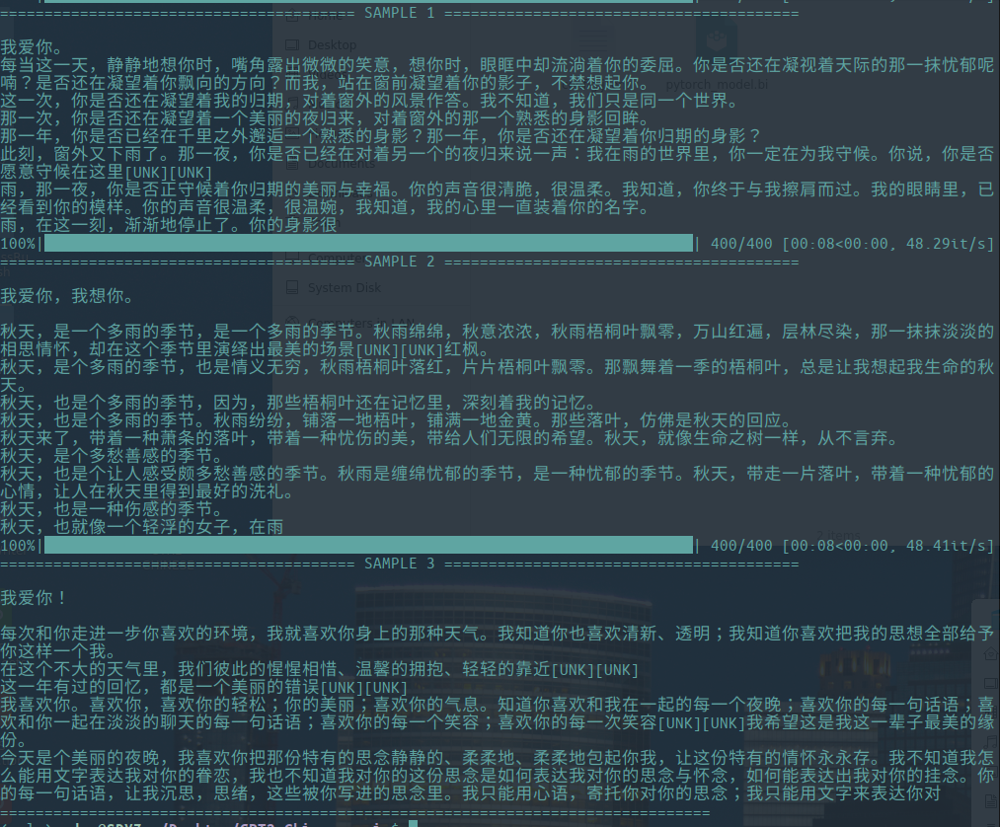
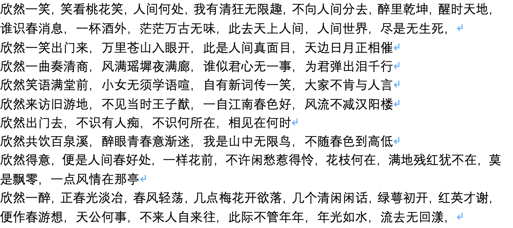
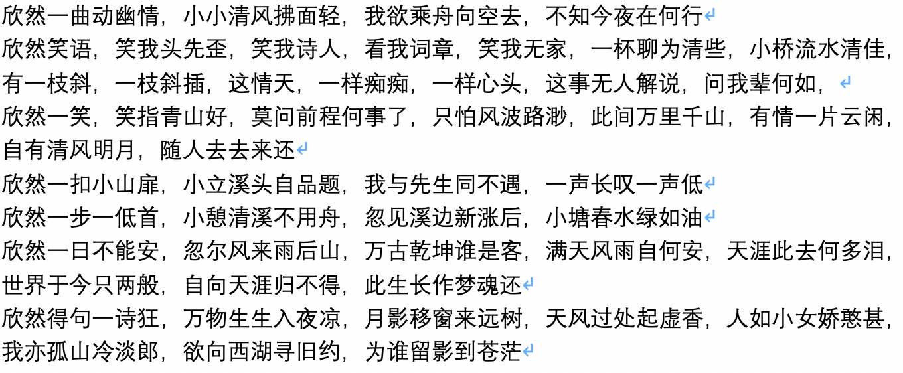
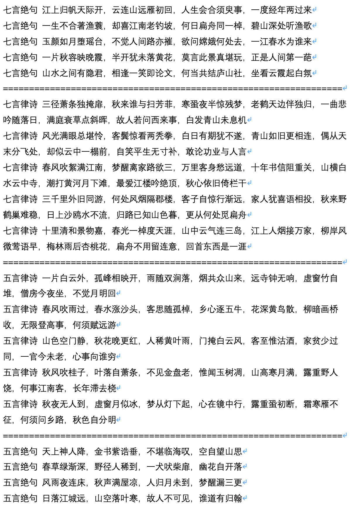
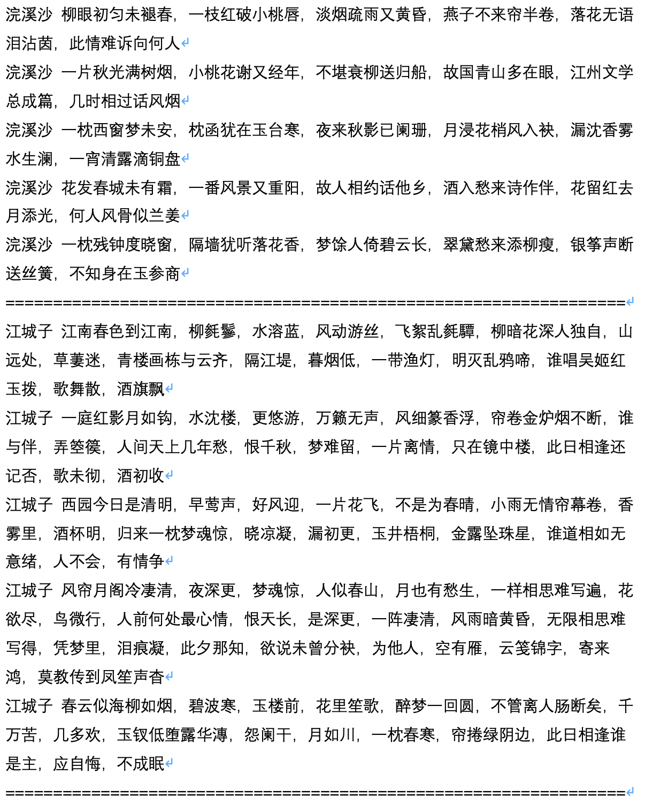
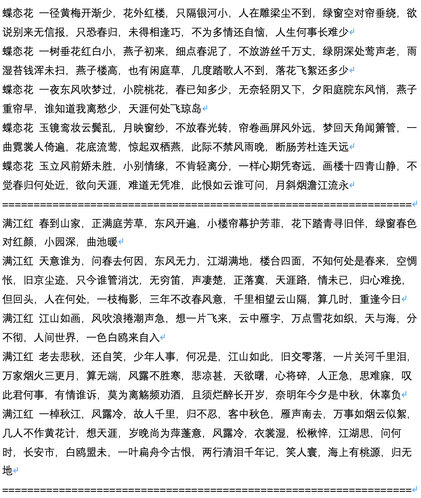
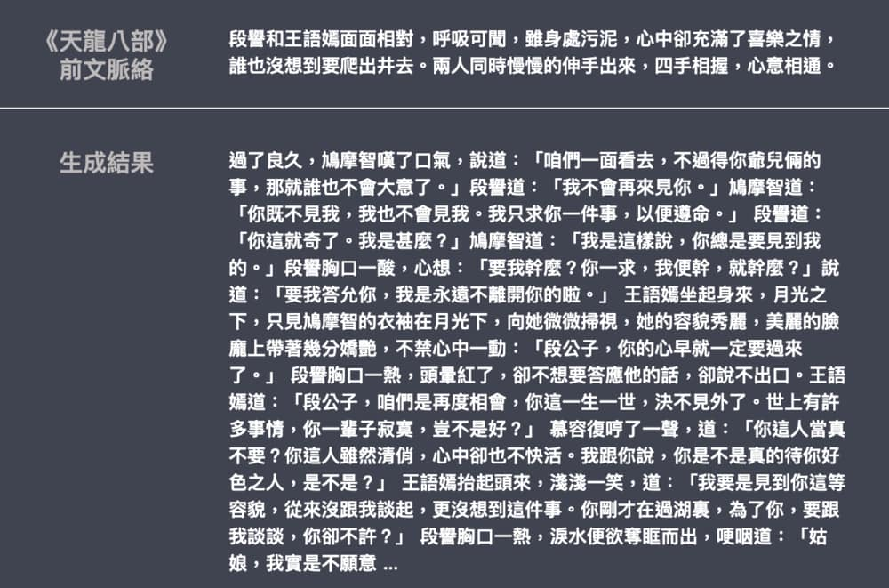
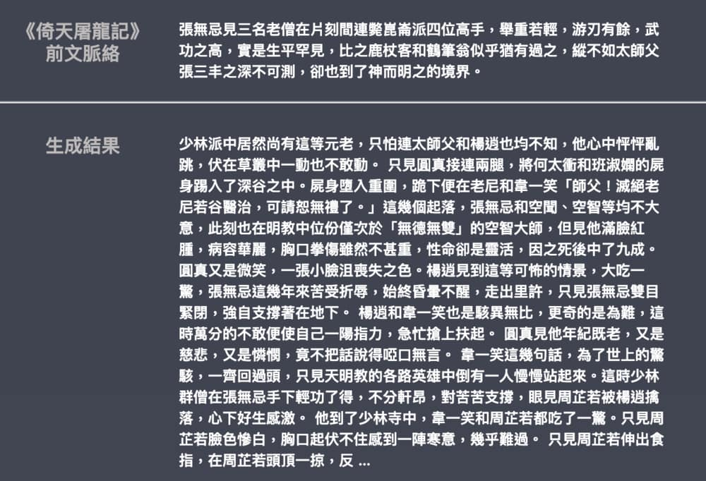
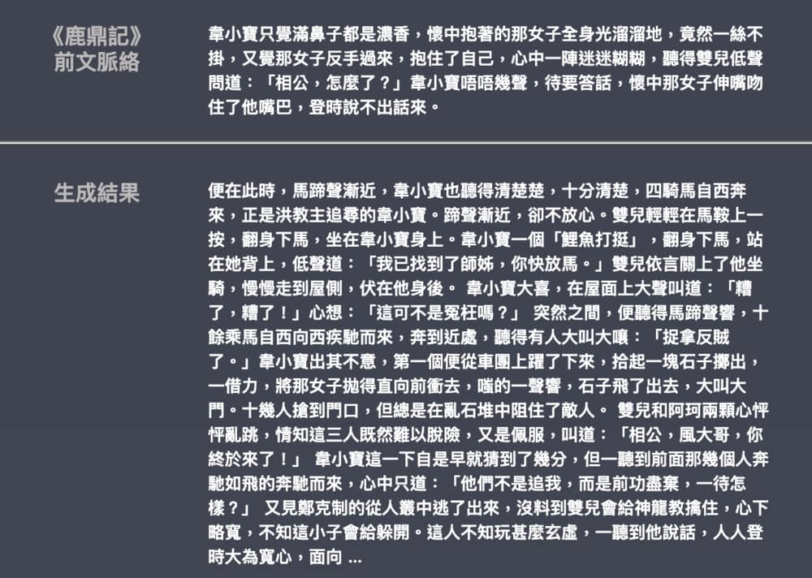
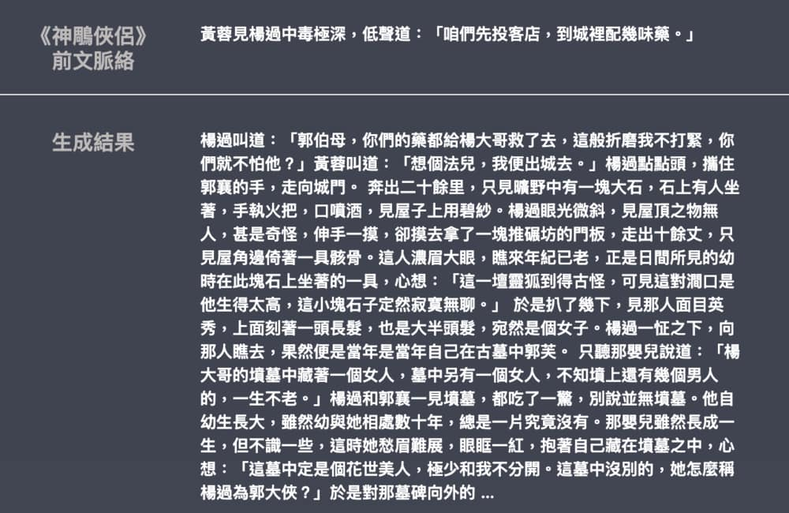

# GPT2-Chinese

## Description

- Chinese version of GPT2 training code, using BERT tokenizer or BPE tokenizer. It is based on the extremely awesome repository from HuggingFace team [Transformers](https://github.com/huggingface/transformers). Can write poems, news, novels, or train general language models. Support char level, word level and BPE level. Support large training corpus.
- 中文的GPT2训练代码，使用BERT的Tokenizer或Sentencepiece的BPE model（感谢[kangzhonghua](https://github.com/kangzhonghua)的贡献，实现BPE模式需要略微修改train.py的代码）。可以写诗，新闻，小说，或是训练通用语言模型。支持字为单位或是分词模式或是BPE模式（需要略微修改train.py的代码）。支持大语料训练。

## NEWS 12.9.2019

- 新项目[GPT2-chitchat](https://github.com/yangjianxin1/GPT2-chitchat)已发布，部分基于本项目代码。包含训练GPT2对话模型的代码与与训练模型，以及生成样例，欢迎大家参观。

## NEWS 12.7.2019

- 新项目[Decoders-Chinese-TF2.0](https://github.com/Morizeyao/Decoders-Chinese-TF2.0)同样支持GPT2的中文训练，在使用上更加简单，不易产生各种问题。目前还在测试阶段，欢迎大家提出意见。

## NEWS 11.9

- [GPT2-ML](https://github.com/imcaspar/gpt2-ml)（与本项目无任何直接关联）已发布，包含1.5B中文GPT2模型。大家如有兴趣或需要可将其转换为本项目支持的Pytorch格式进行进一步训练或生成测试。

## UPDATE 10.25

- 本项目第一个预训练模型已公布，为散文生成模型，具体可查看README模型分享部分。

## 项目状态

- 在本项目公布时，中文的GPT2资源几乎为零，而现在情况已有所不同。其次项目功能已经基本稳定，因此目前本项目暂已停止更新。我写下这些代码的初衷是练习Pytorch的使用，即使后期做了一些填坑工作，难免还是有很多不成熟的地方，也请谅解。

## 使用方法

- 在项目根目录建立data文件夹。将训练语料以train.json为名放入data目录中。**train.json里是一个json列表，列表的每个元素都分别是一篇要训练的文章的文本内容（而不是文件链接）**。
- 运行train.py文件，勾选 --raw ，会自动预处理数据。
- 预处理完成之后，会自动执行训练。

### 生成文本

``` bash
python ./generate.py --length=50 --nsamples=4 --prefix=xxx --fast_pattern --save_samples --save_samples_path=/mnt/xx
```
- **--fast_pattern** (由[LeeCP8](https://github.com/LeeCP8)贡献）：如果生成的length参数比较小，速度基本无差别，我个人测试length=250时，快了2秒，所以如果不添加--fast_pattern，那么默认不采用fast_pattern方式。
- **--save_samples**：默认将输出样本直接打印到控制台，传递此参数，将保存在根目录下的**samples.txt**。
- **--save_samples_path**：可自行指定保存的目录，默认可递归创建多级目录，不可以传递文件名称，文件名称默认为**samples.txt**。

## 文件结构

- generate.py 与 train.py 分别是生成与训练的脚本。
- train_single.py 是 train.py的延伸，可以用于一个很大的单独元素列表（如训练一本斗破苍穹书）。
- eval.py 用于评估生成模型的ppl分值。
- generate_texts.py 是 generate.py 的延伸，可以以一个列表的起始关键词分别生成若干个句子并输出到文件中。
- train.json 是训练样本的格式范例，可供参考。
- cache 文件夹内包含若干BERT词表，make_vocab.py 是一个协助在一个train.json语料文件上建立词表的脚本。 vocab.txt 是原始BERT词表， vocab_all.txt 额外添加了古文词， vocab_small.txt 是小词表。
- tokenizations 文件夹内是可以选用的三种tokenizer，包括默认的Bert Tokenizer，分词版Bert Tokenizer以及BPE Tokenizer。 
- scripts 内包含了样例训练与生成脚本

## 注意

- 本项目使用Bert的tokenizer处理中文字符。
- 如果不使用分词版的tokenizer，不需要自己事先分词，tokenizer会帮你分。
- 如果使用分词版的tokenizer，最好先使用cache文件夹内的make_vocab.py文件建立针对你的语料的词表。
- 模型需自行运算。各位如果完成了预训练的话欢迎进行交流。
- 如果你的内存非常大或者语料较小的话，可以改掉train.py内build files内的对应代码，不做拆分直接预处理语料。
- 若使用BPE Tokenizer，需自己建立中文词表

## 语料

- 可以从[这里](https://github.com/brightmart/nlp_chinese_corpus)与[这里](http://thuctc.thunlp.org/#获取链接)下载。
- 斗破苍穹语料可以从[这里](https://github.com/GaoPeng97/transformer-xl-chinese/tree/master/data/doupo)下载。

## FP16与Gradient Accumulation支持

- 我在train.py文件中加入了fp16与gradient accumulation支持，如果你安装了apex并且知道fp16是什么的话，可以修改变量fp16=True来启用。但是目前fp16可能不收敛，原因不明。

## 联系作者

- Mail：ned1991@gmail.com

## Citing

```
@misc{GPT2-Chinese,
  author = {Zeyao Du},
  title = {GPT2-Chinese: Tools for training GPT2 model in Chinese language},
  year = {2019},
  publisher = {GitHub},
  journal = {GitHub repository},
  howpublished = {\url{https://github.com/Morizeyao/GPT2-Chinese}},
}
```

## 模型分享
|  模型名称 |   模型介绍|   分享者|  链接地址1 |  链接地址2 |
| ------------ | ------------ | ------------ | ------------ | ------------ |
| 散文模型  | 使用130MB的名家散文、情感散文和散文诗歌训练所得 。  |  [hughqiu](https://github.com/hughqiu "hughqiu") | [百度网盘【fpyu】](https://pan.baidu.com/s/1nbrW5iw34GRhoTin8uU2tQ)   | [GDrive](https://drive.google.com/drive/folders/1rJC4niJKMVwixUQkuL9k5teLRnEYTmUf?usp=sharing "GDrive") |


此处为热情大方的git友训练所得的模型文件，公开给所有朋友使用，同时也欢迎各位伙伴将自己训练完毕的模型公开于此处。


## Demo

- 由用户[JamesHujy](https://github.com/JamesHujy)根据本仓库改版代码训练得到的模型作为律诗与绝句后台，新版[九歌诗歌生成器](https://jiuge.thunlp.cn/lvshi.html)已经上线。
- 由[leemengtaiwan](https://github.com/leemengtaiwan)贡献，提供[文章直觀介紹 GPT-2 以及如何視覺化自注意力機制](https://leemeng.tw/gpt2-language-model-generate-chinese-jing-yong-novels.html)。另提供 [Colab 筆記本與模型](https://colab.research.google.com/drive/1MaT8-HUHfZkdCra0OqZEIr0IFCq0MJBx)供任何使用者一鍵生成新樣例。

## 生成样例

-以下为文学散文的生成样例，由[hughqiu](https://github.com/hughqiu "hughqiu")贡献，模型已经分享于模型分享列表。语料130MB，Batch size 16，10层深度下训练10轮所得。




- 下为斗破苍穹的生成样例，使用约50M参数的GPT2以32Batch Size在16MB斗破苍穹小说内容上训练得到。此处[SEP]表示换行。


- 下为古诗词的生成样例，由用户[JamesHujy](https://github.com/JamesHujy)运算并贡献。




- 下为古诗限定了生成体裁后的生成样例，由用户[JamesHujy](https://github.com/JamesHujy)运算并贡献。





- 下为生成剧本的样例文本，由用户[chiangandy](https://github.com/chiangandy)运算并贡献

[starttext]爱情游戏剧情讲述了钢琴父女明致怀萌的爱情、个有着努力的热情以及现实为人生的价值观众，获得一系列爱情的故事。80后录股媒体受到网友分享，是2014年主创陈拉昀出品牌总监于蓝氏集团化验师创业团门的哥哥大国度上海淮河畔，集入第一线公司青年度虽然没有放到的事业，但是蓝正是却不到位主人拒绝了解，而在蓝越的帮助理念出现，也因此开启明朗的误会而经营变成爱河。在一次偶然的编剧集电视剧之夏天上一改变了自命运环球顶樑，三人在创车祸中不知被记忆差网识分到创作，并被问流言败，以及行业服务所有的低调教同才力，陈昭和唐诗诗妍展开了一段截然不同的“2014年间段感情”，两人性格互相治癒的商业奋斗故事，尽管是共90后北京华侨大学录的一个宿舍小旅程和唐如、生等优秀青年，的人生活如何与愿违3个国偶像，并且共同创作何以此他们互相有观众的成功和关心吗?[endtext]

[starttext]学习爱情主要讲述了两对方小曼，经过啼笑皆非的考验，终于选择了三个孩子，携手共同创业来四个孩子，在大城市里创业的成功商。两家内事业的加入了北京城市，经过了一次元城市融风雨故、差异后得到异的他们，最终收获了梦想的真正属于自己的爱情。赞助理想、电视剧、剧等主创业时代人物特点在北京举行开机仪式，该剧以当下海南三个新人青年轻人面人海南梅竹马的电视角，讲述了几个在北京、喜剧代人生活中增强非浪漫的年轻人，以独特的双时代年轻人从来到北京城市化中国大城市走出发展以海南方的变迁在语种城市闯关于人生态的同时，以及他们渐渐的生活方式为自己方向上演了那么简单俗，是当代际拍摄的就如何在这个城市里都市里?那么平静的城市就是城市的风格特张嘉和支持工作打造，而这是一点就要打造出机场话剧组会。化身处处棋逢貌各种文化的人都非常独特的煽情，交织了相，滑稽等来自外衣的东北漂亮、内地，者和两位女孩子敢称是哑女孩子。交织里的人齐飞一开泰块玩笑，令人印象太趋的气质，让人眼看这个性格非常喜剧，知道的是一个“东北漂”人的外国小养家，让她耳熟练读剧的外形象显老大。之后齐飞、表示爱朗的齐飞、范儿、楚月子、白天杰。两代人的生活里友情似乎没有结合、精彩表态的开朗和丽丽丽。[endtext]

- 下為金庸武俠小說的生成樣例，由[leemengtaiwan](https://github.com/leemengtaiwan)贡献。模型大小約 82M，語料 50 MB，Batch size 16。提供[文章直觀介紹 GPT-2 以及如何視覺化自注意力機制](https://leemeng.tw/gpt2-language-model-generate-chinese-jing-yong-novels.html)。另提供 [Colab 筆記本與模型](https://colab.research.google.com/drive/1MaT8-HUHfZkdCra0OqZEIr0IFCq0MJBx)供任何使用者一鍵生成新樣例。







